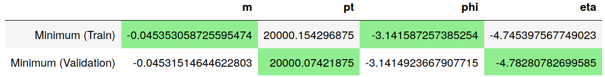
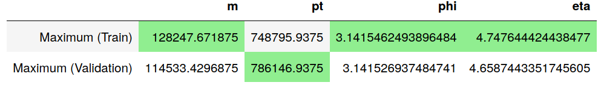

<h1 align="center">ATLAS Task Autoencoders</h1>

Compression of [data](https://github.com/alti-tude/atlas_task/tree/master/datasets) from 4-D to 3-D using autoencoders. 

## Running the project

Clone the repo.
```
sudo apt-install python3 python3-pip
pip3 install torch tensorflow pandas numpy matplotlib tqdm jupyter
jupyter notebook
```
NOTE: This codebase only works for python3.

## Directory structure

* `Atlas Task.ipynb` contains the main code for training and running the model.
* `datasets/` contains the data in pickled format.
* `models/` contains the latest model that will be used.
* `runs/` is used for logging of TensorBoard metrics.
* `graphs/` containss all the output graphs created.


## Data

The data is 4 dimensional. The features are `m`, `pt`, `phi`, `eta`.

The minimum value of each of the train and validation data features is as follows. The minimum value of each column is colored.



The maximum value of each of the train and validation data features is as follows. The maximum value of each column is colored.



>NOTE: This shows that we don't have coverage over the entire validation set. Hence normalisation to range 
(  )
won't work.

Both the datasets are unpickled and loaded into Pandas dataframes. Normalization is done for both datasets using the mean and standard deviation of the features of only the train data. The train_mean and train_std are reported as follows:

<table>
<thead>
<tr>
  <th></th>
  <th>m</th>
  <th>pt</th>
  <th>phi</th>
  <th>eta</th>
</tr>
</thead>
<tbody>
<tr>
  <td>Mean (Train)</td>
  <td>8941.356798574077</td>
  <td>64458.68347131494</td>
  <td>0.0016911698064246217</td>
  <td>0.043500007558950136</td>
</tr>
<tr>
  <td>Standard Deviation (Train)</td>
  <td>7421.270110526609</td>
  <td>69874.99302638602</td>
  <td>1.8031508801540208</td>
  <td>1.4484389818869485</td>
</tr>
</tbody>
</table>

## Model

### Architecture


### Parameter

The initial parameters are as follows.

<table>
<thead>
<tr>
	<th>Parameter</th>
	<th>Value</th>
	<th>Variable name</th>
</tr>
</thead>
<tbody>
<tr>
	<td>Batch size</td>
	<td>200000</td>
	<td>BATCH_SIZE</td>
</tr>
<tr>
	<td>Epochs</td>
	<td>10000</td>
	<td>EPOCHS</td>
</tr>
<tr>
	<td>Learning rate</td>
	<td>0.001</td>
	<td>LR</td>
</tr>
<tr>
	<td>Scheduler patience</td>
	<td>100</td>
	<td>SCHEDULER_PATIENCE</td>
</tr>
<tr>
	<td>Activation function</td>
	<td>Hyperbolic Tangent</td>
	<td>MODEL_ACTIVATION_FUNC</td>
</tr>
</tbody>
</table>


